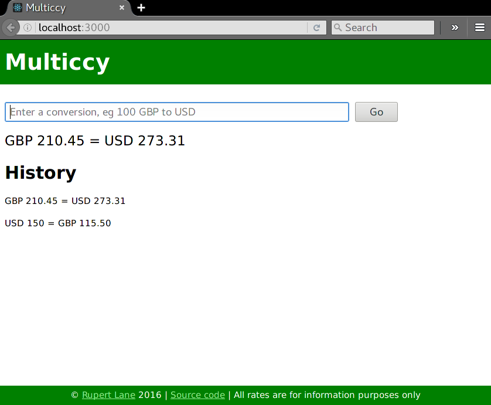

# Multiccy

A simple web application to convert currencies.

## Demo

A working demo can be found at https://multiccy.rupert-lane.org/

Enter a conversion in the box and press go. The result will be
displayed on top and a scrolling history of previous conversions will
be displayed below.

The app is fairly loose in how you enter the conversion, for example:

- 100 GBP to USD
- EUR 250 into ¥
- $100 thb

## Design

The project is written in ES6 Javascript and contains a server and
client npm module.

The client uses React and Webpack via react-scripts. Styling is simple
CSS. It will load the FX rates from the server at startup and after
that does not need to communicate again with the server so can be used
offline. Reload the page to pick up updated rates.

The server is an Express application that reads rates from the
provider, [Open Exchange Rates](https://openexchangerates.org/), every
six hours and serves up a cached copy to the client. If you want to
run your own version you'll need
an [API key](https://openexchangerates.org/signup) or you can
implement a different source of rates.

## License

multiccy is free software, released under the GNU General Public
License version 3 (or later). See COPYING for further details of the
license.
